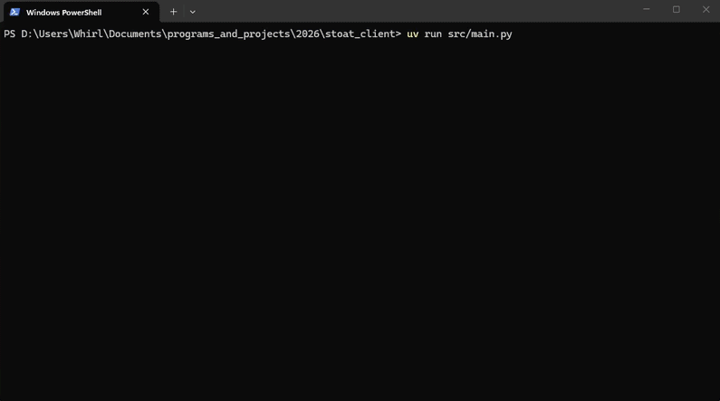

# Stoat CLIent

Stoat CLIent [Stoat CLI-ent] is a small client for [stoat.chat](https://stoat.chat) in the terminal.

# Known support

- [x] windows
- [ ] linux (Assumed to work since only ANSI codes are being used for rendering)
- [ ] macos (No clue what Mac ANSI support looks like)

# Controls

- `tab` toggle between textmode and commandmode
- `enter` send text buffer (send chat or command)
- `ctrl+q` quit console application (ctrl + c to then close app fully)
- `left-arrow` text cursor left
- `right-arrow` text cursor right
- `up-arrow` text cursor up (useless right now)
- `down-arrow` text cursor down (useless right now)
- `pgdown` scrolls main chat window down
- `pgup` scrolls main chat window up (see history). Scroll is preserved when new messages come in (so you don't lose your place)
- `ctrl+v` paste (via pyperclip)

# Commands

- `# [channel name | channel number]` change active channel
- `> [server name | server number]` change active server
- `servers` shows all available servers
- `channels` shows all available channels in a server
- `q` quit console app

 

# Usage Steps

## 1: Run the application

Do it- it will generate a config.toml

## 2: Go to the browser and get your token

- Login to stoat in your browser
- Now inspect the page and go to the `network` tab
- Click a request
- find `X-session-token` in a request header
- pull that value and put it in your `stoat_token` config option.

## 3: Start the app

Start that shit again
